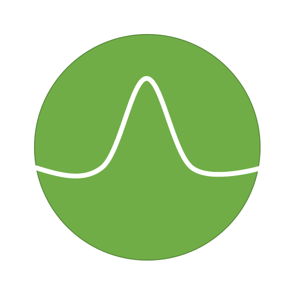
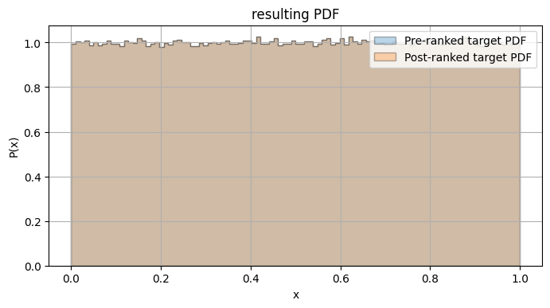
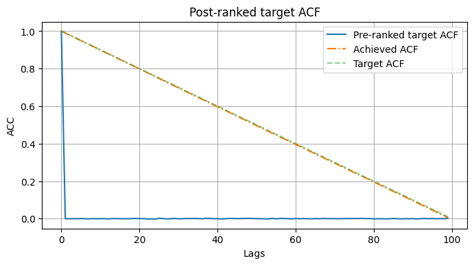

  
.. image:: https://img.shields.io/badge/Creators-D.%20Bykhovsky%2C%20A.%20Rudyak%2C%20N.%20Tochilvosky-blue
  :align: center
  
.. image:: https://img.shields.io/badge/Version-v1.0.0-green
  :align: center

.. image:: https://img.shields.io/badge/License-MIT-lightgreen
  :align: center
  
|
  
Generate_corr_sequence
=============

We've created a Python function capable of creating ``L`` sized vecor of samples, having a desired CDF function and ACC.

To work with it, the user needs to have a desired function

For that purpose we made helper functions:

1. ``findCoeff`` - find the d coefficients of a given distribution
2. ``integration_function`` - a function that integrated over the non-inversed CDF solution
3. ``find_ro_x`` - add roh_x explained # maybe change the function name?
4. ``findFilter`` - find the required filter for the desired ACF
5. ``get_ranked_sequence`` - rank match the sequence to get the desired ACF
6. ``drawDebugPlots`` - if something doesnt work this might give an insight with plots about whats going on

Summary
-------
   
The function 

Usage
-----

How to use the function.

.. code-block:: python

    # Example usage of the function
    result = function_name(arg1, arg2)
    print(result)

Arguments
---------

- ``arg1`` (type): Description of the first argument.
- ``arg2`` (type): Description of the second argument.

Returns
-------

- ``return_type``: Description of the return value.

Version History
---------------

- Version X.X.X: Description of changes made in this version.
- Version X.X.X: Description of changes made in this version.
- Version X.X.X: Description of changes made in this version.

See Also
--------

Other related functions, classes or modules that may be useful to reference.

References
----------

Any references or resources used to develop the function or related to the function.

Contributors
------------

- Your Name (https://github.com/your_username)
- Contributor Name (https://github.com/contributor_username)

License
-------

This project is licensed under the `MIT <./LICENSE.md>`_ license.

Examples
=============

When all values are default
-------

.. code-block:: python

    # Example usage of the function with all default values
    sequence = generate_corr_sequence(debug=True)
    

  

