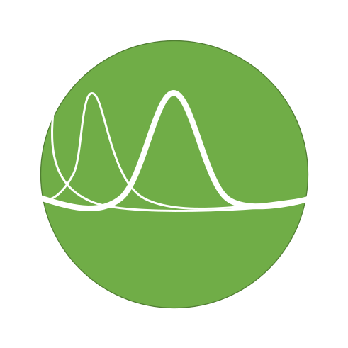

  
.. image:: https://img.shields.io/badge/Creators-D.%20Bykhovsky%2C%20A.%20Rudyak%2C%20N.%20Tochilvosky-blue?style=for-the-badge&logo=data:image/svg+xml;base64,PHN2ZyB3aWR0aD0iNDkxIiBoZWlnaHQ9IjQ5MSIgeG1sbnM9Imh0dHA6Ly93d3cudzMub3JnLzIwMDAvc3ZnIiB4bWxuczp4bGluaz0iaHR0cDovL3d3dy53My5vcmcvMTk5OS94bGluayIgb3ZlcmZsb3c9ImhpZGRlbiI+PGRlZnM+PGNsaXBQYXRoIGlkPSJjbGlwMCI+PHJlY3QgeD0iMCIgeT0iMCIgd2lkdGg9IjQ5MSIgaGVpZ2h0PSI0OTEiLz48L2NsaXBQYXRoPjwvZGVmcz48ZyBjbGlwLXBhdGg9InVybCgjY2xpcDApIj48cmVjdCB4PSIwIiB5PSIwIiB3aWR0aD0iNDkxIiBoZWlnaHQ9IjQ5MSIgZmlsbD0iI0ZGRkZGRiIgZmlsbC1vcGFjaXR5PSIwIi8+PHBhdGggZD0iTTU3LjUgMjQ2QzU3LjUgMTQxLjg5NCAxNDEuODk0IDU3LjUgMjQ2IDU3LjUgMzUwLjEwNiA1Ny41IDQzNC41IDE0MS44OTQgNDM0LjUgMjQ2IDQzNC41IDM1MC4xMDYgMzUwLjEwNiA0MzQuNSAyNDYgNDM0LjUgMTQxLjg5NCA0MzQuNSA1Ny41IDM1MC4xMDYgNTcuNSAyNDZaIiBzdHJva2U9IiM1MDdFMzIiIHN0cm9rZS13aWR0aD0iMS4zMzI0MyIgc3Ryb2tlLW1pdGVybGltaXQ9IjgiIGZpbGw9IiM3MEFENDciIGZpbGwtcnVsZT0iZXZlbm9kZCIvPjxwYXRoIGQ9Ik03Ni4wMTIgMTUwLjVDNjguNTg0MiAyMTEuODQgNzQuOTY0MiAyNjMuNTkxIDEzMS45NDQgMjg1LjY5NiAxODguOTI0IDMwNy44MDIgNDE0LjAxNiAyOTMuOTQ2IDQzMC41IDI4My43MyIgc3Ryb2tlPSIjRkZGRkZGIiBzdHJva2Utd2lkdGg9IjIuOTk3OTYiIHN0cm9rZS1taXRlcmxpbWl0PSI4IiBmaWxsPSJub25lIiBmaWxsLXJ1bGU9ImV2ZW5vZGQiLz48cGF0aCBkPSJNNjAuNSAyNzcuNDc1QzcxLjA1ODEgMjg5LjkwOCA5Mi4zOTc2IDI2OC4xOTYgMTA0LjIwNCAyNDMuOTE0IDExNi4wMTEgMjE5LjYzMSAxMTQuNjY2IDEyNS43MDMgMTMxLjM0MSAxMzEuNzgyIDE0OC4wMTUgMTM3Ljg2MSAxNTUuNTIzIDI1NS43MTkgMjA0LjI1MiAyODAuMzg5IDI1Mi45ODIgMzA1LjA2IDM0My43NDEgMjkyLjQzMyA0MzQuNSAyNzkuODA2IiBzdHJva2U9IiNGRkZGRkYiIHN0cm9rZS13aWR0aD0iMi45OTc5NiIgc3Ryb2tlLW1pdGVybGltaXQ9IjgiIGZpbGw9Im5vbmUiIGZpbGwtcnVsZT0iZXZlbm9kZCIvPjxwYXRoIGQ9Ik01NyAyNzkuMjcxQzk3Ljg5MTYgMjkxLjkyNiAxMzguNzgzIDMwNC41ODEgMTcwLjEgMjc5Ljg2OSAyMDEuNDE3IDI1NS4xNTcgMjE5Ljg2OCAxMzEgMjQ0LjkwMiAxMzEgMjY5LjkzNSAxMzEgMjg4Ljc4NSAyNTQuODU4IDMyMC4zMDIgMjc5Ljg2OSAzNTEuODE4IDMwNC44OCA0MzQgMjgxLjA2NSA0MzQgMjgxLjA2NSIgc3Ryb2tlPSIjRkZGRkZGIiBzdHJva2Utd2lkdGg9IjcuOTk0NTciIHN0cm9rZS1taXRlcmxpbWl0PSI4IiBmaWxsPSJub25lIiBmaWxsLXJ1bGU9ImV2ZW5vZGQiLz48L2c+PC9zdmc+
  :align: center
  
.. image:: https://img.shields.io/badge/Version-v0.0.1-orange?style=for-the-badge&logo=data:image/svg+xml;base64,PHN2ZyB3aWR0aD0iNDkxIiBoZWlnaHQ9IjQ5MSIgeG1sbnM9Imh0dHA6Ly93d3cudzMub3JnLzIwMDAvc3ZnIiB4bWxuczp4bGluaz0iaHR0cDovL3d3dy53My5vcmcvMTk5OS94bGluayIgb3ZlcmZsb3c9ImhpZGRlbiI+PGRlZnM+PGNsaXBQYXRoIGlkPSJjbGlwMCI+PHJlY3QgeD0iMCIgeT0iMCIgd2lkdGg9IjQ5MSIgaGVpZ2h0PSI0OTEiLz48L2NsaXBQYXRoPjwvZGVmcz48ZyBjbGlwLXBhdGg9InVybCgjY2xpcDApIj48cmVjdCB4PSIwIiB5PSIwIiB3aWR0aD0iNDkxIiBoZWlnaHQ9IjQ5MSIgZmlsbD0iI0ZGRkZGRiIgZmlsbC1vcGFjaXR5PSIwIi8+PHBhdGggZD0iTTU3LjUgMjQ2QzU3LjUgMTQxLjg5NCAxNDEuODk0IDU3LjUgMjQ2IDU3LjUgMzUwLjEwNiA1Ny41IDQzNC41IDE0MS44OTQgNDM0LjUgMjQ2IDQzNC41IDM1MC4xMDYgMzUwLjEwNiA0MzQuNSAyNDYgNDM0LjUgMTQxLjg5NCA0MzQuNSA1Ny41IDM1MC4xMDYgNTcuNSAyNDZaIiBzdHJva2U9IiM1MDdFMzIiIHN0cm9rZS13aWR0aD0iMS4zMzI0MyIgc3Ryb2tlLW1pdGVybGltaXQ9IjgiIGZpbGw9IiM3MEFENDciIGZpbGwtcnVsZT0iZXZlbm9kZCIvPjxwYXRoIGQ9Ik03Ni4wMTIgMTUwLjVDNjguNTg0MiAyMTEuODQgNzQuOTY0MiAyNjMuNTkxIDEzMS45NDQgMjg1LjY5NiAxODguOTI0IDMwNy44MDIgNDE0LjAxNiAyOTMuOTQ2IDQzMC41IDI4My43MyIgc3Ryb2tlPSIjRkZGRkZGIiBzdHJva2Utd2lkdGg9IjIuOTk3OTYiIHN0cm9rZS1taXRlcmxpbWl0PSI4IiBmaWxsPSJub25lIiBmaWxsLXJ1bGU9ImV2ZW5vZGQiLz48cGF0aCBkPSJNNjAuNSAyNzcuNDc1QzcxLjA1ODEgMjg5LjkwOCA5Mi4zOTc2IDI2OC4xOTYgMTA0LjIwNCAyNDMuOTE0IDExNi4wMTEgMjE5LjYzMSAxMTQuNjY2IDEyNS43MDMgMTMxLjM0MSAxMzEuNzgyIDE0OC4wMTUgMTM3Ljg2MSAxNTUuNTIzIDI1NS43MTkgMjA0LjI1MiAyODAuMzg5IDI1Mi45ODIgMzA1LjA2IDM0My43NDEgMjkyLjQzMyA0MzQuNSAyNzkuODA2IiBzdHJva2U9IiNGRkZGRkYiIHN0cm9rZS13aWR0aD0iMi45OTc5NiIgc3Ryb2tlLW1pdGVybGltaXQ9IjgiIGZpbGw9Im5vbmUiIGZpbGwtcnVsZT0iZXZlbm9kZCIvPjxwYXRoIGQ9Ik01NyAyNzkuMjcxQzk3Ljg5MTYgMjkxLjkyNiAxMzguNzgzIDMwNC41ODEgMTcwLjEgMjc5Ljg2OSAyMDEuNDE3IDI1NS4xNTcgMjE5Ljg2OCAxMzEgMjQ0LjkwMiAxMzEgMjY5LjkzNSAxMzEgMjg4Ljc4NSAyNTQuODU4IDMyMC4zMDIgMjc5Ljg2OSAzNTEuODE4IDMwNC44OCA0MzQgMjgxLjA2NSA0MzQgMjgxLjA2NSIgc3Ryb2tlPSIjRkZGRkZGIiBzdHJva2Utd2lkdGg9IjcuOTk0NTciIHN0cm9rZS1taXRlcmxpbWl0PSI4IiBmaWxsPSJub25lIiBmaWxsLXJ1bGU9ImV2ZW5vZGQiLz48L2c+PC9zdmc+
  :align: center

.. image:: https://img.shields.io/badge/License-MIT-lightgreen?style=for-the-badge&logo=data:image/svg+xml;base64,PHN2ZyB3aWR0aD0iNDkxIiBoZWlnaHQ9IjQ5MSIgeG1sbnM9Imh0dHA6Ly93d3cudzMub3JnLzIwMDAvc3ZnIiB4bWxuczp4bGluaz0iaHR0cDovL3d3dy53My5vcmcvMTk5OS94bGluayIgb3ZlcmZsb3c9ImhpZGRlbiI+PGRlZnM+PGNsaXBQYXRoIGlkPSJjbGlwMCI+PHJlY3QgeD0iMCIgeT0iMCIgd2lkdGg9IjQ5MSIgaGVpZ2h0PSI0OTEiLz48L2NsaXBQYXRoPjwvZGVmcz48ZyBjbGlwLXBhdGg9InVybCgjY2xpcDApIj48cmVjdCB4PSIwIiB5PSIwIiB3aWR0aD0iNDkxIiBoZWlnaHQ9IjQ5MSIgZmlsbD0iI0ZGRkZGRiIgZmlsbC1vcGFjaXR5PSIwIi8+PHBhdGggZD0iTTU3LjUgMjQ2QzU3LjUgMTQxLjg5NCAxNDEuODk0IDU3LjUgMjQ2IDU3LjUgMzUwLjEwNiA1Ny41IDQzNC41IDE0MS44OTQgNDM0LjUgMjQ2IDQzNC41IDM1MC4xMDYgMzUwLjEwNiA0MzQuNSAyNDYgNDM0LjUgMTQxLjg5NCA0MzQuNSA1Ny41IDM1MC4xMDYgNTcuNSAyNDZaIiBzdHJva2U9IiM1MDdFMzIiIHN0cm9rZS13aWR0aD0iMS4zMzI0MyIgc3Ryb2tlLW1pdGVybGltaXQ9IjgiIGZpbGw9IiM3MEFENDciIGZpbGwtcnVsZT0iZXZlbm9kZCIvPjxwYXRoIGQ9Ik03Ni4wMTIgMTUwLjVDNjguNTg0MiAyMTEuODQgNzQuOTY0MiAyNjMuNTkxIDEzMS45NDQgMjg1LjY5NiAxODguOTI0IDMwNy44MDIgNDE0LjAxNiAyOTMuOTQ2IDQzMC41IDI4My43MyIgc3Ryb2tlPSIjRkZGRkZGIiBzdHJva2Utd2lkdGg9IjIuOTk3OTYiIHN0cm9rZS1taXRlcmxpbWl0PSI4IiBmaWxsPSJub25lIiBmaWxsLXJ1bGU9ImV2ZW5vZGQiLz48cGF0aCBkPSJNNjAuNSAyNzcuNDc1QzcxLjA1ODEgMjg5LjkwOCA5Mi4zOTc2IDI2OC4xOTYgMTA0LjIwNCAyNDMuOTE0IDExNi4wMTEgMjE5LjYzMSAxMTQuNjY2IDEyNS43MDMgMTMxLjM0MSAxMzEuNzgyIDE0OC4wMTUgMTM3Ljg2MSAxNTUuNTIzIDI1NS43MTkgMjA0LjI1MiAyODAuMzg5IDI1Mi45ODIgMzA1LjA2IDM0My43NDEgMjkyLjQzMyA0MzQuNSAyNzkuODA2IiBzdHJva2U9IiNGRkZGRkYiIHN0cm9rZS13aWR0aD0iMi45OTc5NiIgc3Ryb2tlLW1pdGVybGltaXQ9IjgiIGZpbGw9Im5vbmUiIGZpbGwtcnVsZT0iZXZlbm9kZCIvPjxwYXRoIGQ9Ik01NyAyNzkuMjcxQzk3Ljg5MTYgMjkxLjkyNiAxMzguNzgzIDMwNC41ODEgMTcwLjEgMjc5Ljg2OSAyMDEuNDE3IDI1NS4xNTcgMjE5Ljg2OCAxMzEgMjQ0LjkwMiAxMzEgMjY5LjkzNSAxMzEgMjg4Ljc4NSAyNTQuODU4IDMyMC4zMDIgMjc5Ljg2OSAzNTEuODE4IDMwNC44OCA0MzQgMjgxLjA2NSA0MzQgMjgxLjA2NSIgc3Ryb2tlPSIjRkZGRkZGIiBzdHJva2Utd2lkdGg9IjcuOTk0NTciIHN0cm9rZS1taXRlcmxpbWl0PSI4IiBmaWxsPSJub25lIiBmaWxsLXJ1bGU9ImV2ZW5vZGQiLz48L2c+PC9zdmc+
  :align: center
  
|
  
Generate_corr_sequence
=============

Summary
-------
   
A python package for generating a random autocorrelated sequence with user preffered autocorrelation function and cumulative distribution function.

Arguments
---------

- ``dist_obj`` - A distribution object from `scipy.stats <https://docs.scipy.org/doc/scipy/reference/stats.html>`_, default is ``uniform``.

- ``desiredACF`` - A desired ACF function with ``m`` as a variable, default is a ``linear function``.

- ``L`` - Number of desired samples, default is ``2^20``.

- ``seed`` - Number as input for the random number generator, default is ``100``.

- ``debug`` - Plots intermidiate graphs, also helps with visualization, default is ``False``.[[1]](#1)

Returns
-------

- ``return_type``: A random sequence with pre-defined ACF and PDF with type ``numpy.ndarray``.

References
----------

<a id="1">[1]</a> 
Dijkstra, E. W. (1968). 
Go to statement considered harmful. 
Communications of the ACM, 11(3), 147-148.

[1] Filho, José Cândido Silveira Santos, and Michael Daoud Yacoub. “Coloring Non-Gaussian Sequences.” IEEE TRANSACTIONS ON SIGNAL PROCESSING, vol. 56, no. 12, 2008, p. 6. 

https://ieeexplore.ieee.org/abstract/document/4633661

Contributors
------------

- `Dima Bykhovsky <https://github.com/bykhov>`_
-  `Netanel Tochilovsky <https://github.com/Nati-Toch>`_
- `Alexander Rudyak <https://github.com/AlexRudyak>`_

License
-------

This project is licensed under the `MIT <./LICENSE.md>`_ license.

Examples
=============

Default settings, uniform distribution and linear ACF
------

.. code-block:: python

    # Example usage of the function with default settings
    sequence = generate_corr_sequence(debug=True)
    
Probability Density Funciton before and after the ACF matching process
----
.. image:: ./examples/defaultPDF.png
  :align: center
  
AutoCorrelation Funciton before and after the ACF matching process
----
.. image:: ./examples/defaultACF.png
  :align: center
  

Rayleigh distribution with exp*cos ACF
-------

.. code-block:: python

    # Example usage of the function with Rayleigh distribution and an autocorrelation function
    import scipy
    import numpy as np
    from scipy.stats import rayleigh

    m = np.arange(0, 100)
    desiredACF = np.exp(-0.05 * np.abs(m)) * np.cos(0.25 * np.abs(m))
    sequence = generate_corr_sequence(rayleigh, desiredACF=desiredACF, L=2**20, seed=100, debug=True)
    
Probability Density Funciton before and after the ACF matching process
----
.. image:: ./examples/exp-0.05mcos0.25mpdf.png
  :align: center
  
AutoCorrelation Funciton before and after the ACF matching process
----
.. image:: ./examples/exp-0.05mcos0.25macf.png
  :align: center

