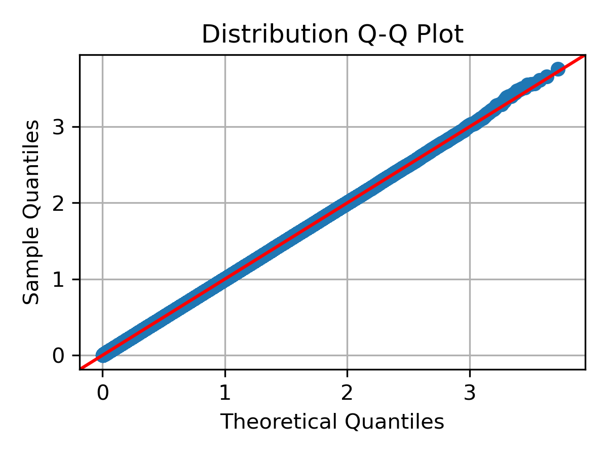
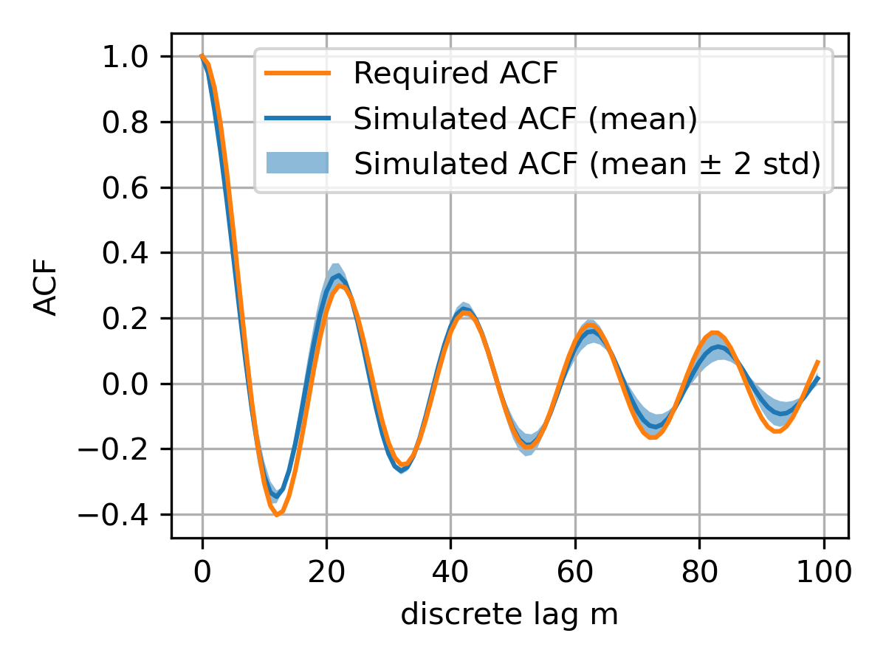

<!--


![image](https://img.shields.io/badge/Creators-D.%20Bykhovsky%2C%20A.%20Rudyak%2C%20N.%20Tochilvosky-blue?style=for-the-badge&logo=data:image/svg+xml;base64,PHN2ZyB3aWR0aD0iNDkxIiBoZWlnaHQ9IjQ5MSIgeG1sbnM9Imh0dHA6Ly93d3cudzMub3JnLzIwMDAvc3ZnIiB4bWxuczp4bGluaz0iaHR0cDovL3d3dy53My5vcmcvMTk5OS94bGluayIgb3ZlcmZsb3c9ImhpZGRlbiI+PGRlZnM+PGNsaXBQYXRoIGlkPSJjbGlwMCI+PHJlY3QgeD0iMCIgeT0iMCIgd2lkdGg9IjQ5MSIgaGVpZ2h0PSI0OTEiLz48L2NsaXBQYXRoPjwvZGVmcz48ZyBjbGlwLXBhdGg9InVybCgjY2xpcDApIj48cmVjdCB4PSIwIiB5PSIwIiB3aWR0aD0iNDkxIiBoZWlnaHQ9IjQ5MSIgZmlsbD0iI0ZGRkZGRiIgZmlsbC1vcGFjaXR5PSIwIi8+PHBhdGggZD0iTTU3LjUgMjQ2QzU3LjUgMTQxLjg5NCAxNDEuODk0IDU3LjUgMjQ2IDU3LjUgMzUwLjEwNiA1Ny41IDQzNC41IDE0MS44OTQgNDM0LjUgMjQ2IDQzNC41IDM1MC4xMDYgMzUwLjEwNiA0MzQuNSAyNDYgNDM0LjUgMTQxLjg5NCA0MzQuNSA1Ny41IDM1MC4xMDYgNTcuNSAyNDZaIiBzdHJva2U9IiM1MDdFMzIiIHN0cm9rZS13aWR0aD0iMS4zMzI0MyIgc3Ryb2tlLW1pdGVybGltaXQ9IjgiIGZpbGw9IiM3MEFENDciIGZpbGwtcnVsZT0iZXZlbm9kZCIvPjxwYXRoIGQ9Ik03Ni4wMTIgMTUwLjVDNjguNTg0MiAyMTEuODQgNzQuOTY0MiAyNjMuNTkxIDEzMS45NDQgMjg1LjY5NiAxODguOTI0IDMwNy44MDIgNDE0LjAxNiAyOTMuOTQ2IDQzMC41IDI4My43MyIgc3Ryb2tlPSIjRkZGRkZGIiBzdHJva2Utd2lkdGg9IjIuOTk3OTYiIHN0cm9rZS1taXRlcmxpbWl0PSI4IiBmaWxsPSJub25lIiBmaWxsLXJ1bGU9ImV2ZW5vZGQiLz48cGF0aCBkPSJNNjAuNSAyNzcuNDc1QzcxLjA1ODEgMjg5LjkwOCA5Mi4zOTc2IDI2OC4xOTYgMTA0LjIwNCAyNDMuOTE0IDExNi4wMTEgMjE5LjYzMSAxMTQuNjY2IDEyNS43MDMgMTMxLjM0MSAxMzEuNzgyIDE0OC4wMTUgMTM3Ljg2MSAxNTUuNTIzIDI1NS43MTkgMjA0LjI1MiAyODAuMzg5IDI1Mi45ODIgMzA1LjA2IDM0My43NDEgMjkyLjQzMyA0MzQuNSAyNzkuODA2IiBzdHJva2U9IiNGRkZGRkYiIHN0cm9rZS13aWR0aD0iMi45OTc5NiIgc3Ryb2tlLW1pdGVybGltaXQ9IjgiIGZpbGw9Im5vbmUiIGZpbGwtcnVsZT0iZXZlbm9kZCIvPjxwYXRoIGQ9Ik01NyAyNzkuMjcxQzk3Ljg5MTYgMjkxLjkyNiAxMzguNzgzIDMwNC41ODEgMTcwLjEgMjc5Ljg2OSAyMDEuNDE3IDI1NS4xNTcgMjE5Ljg2OCAxMzEgMjQ0LjkwMiAxMzEgMjY5LjkzNSAxMzEgMjg4Ljc4NSAyNTQuODU4IDMyMC4zMDIgMjc5Ljg2OSAzNTEuODE4IDMwNC44OCA0MzQgMjgxLjA2NSA0MzQgMjgxLjA2NSIgc3Ryb2tlPSIjRkZGRkZGIiBzdHJva2Utd2lkdGg9IjcuOTk0NTciIHN0cm9rZS1taXRlcmxpbWl0PSI4IiBmaWxsPSJub25lIiBmaWxsLXJ1bGU9ImV2ZW5vZGQiLz48L2c+PC9zdmc+)

[![image](https://img.shields.io/pypi/v/generate_corr_sequence?style=for-the-badge&logo=data:image/svg+xml;base64,PHN2ZyB3aWR0aD0iNDkxIiBoZWlnaHQ9IjQ5MSIgeG1sbnM9Imh0dHA6Ly93d3cudzMub3JnLzIwMDAvc3ZnIiB4bWxuczp4bGluaz0iaHR0cDovL3d3dy53My5vcmcvMTk5OS94bGluayIgb3ZlcmZsb3c9ImhpZGRlbiI+PGRlZnM+PGNsaXBQYXRoIGlkPSJjbGlwMCI+PHJlY3QgeD0iMCIgeT0iMCIgd2lkdGg9IjQ5MSIgaGVpZ2h0PSI0OTEiLz48L2NsaXBQYXRoPjwvZGVmcz48ZyBjbGlwLXBhdGg9InVybCgjY2xpcDApIj48cmVjdCB4PSIwIiB5PSIwIiB3aWR0aD0iNDkxIiBoZWlnaHQ9IjQ5MSIgZmlsbD0iI0ZGRkZGRiIgZmlsbC1vcGFjaXR5PSIwIi8+PHBhdGggZD0iTTU3LjUgMjQ2QzU3LjUgMTQxLjg5NCAxNDEuODk0IDU3LjUgMjQ2IDU3LjUgMzUwLjEwNiA1Ny41IDQzNC41IDE0MS44OTQgNDM0LjUgMjQ2IDQzNC41IDM1MC4xMDYgMzUwLjEwNiA0MzQuNSAyNDYgNDM0LjUgMTQxLjg5NCA0MzQuNSA1Ny41IDM1MC4xMDYgNTcuNSAyNDZaIiBzdHJva2U9IiM1MDdFMzIiIHN0cm9rZS13aWR0aD0iMS4zMzI0MyIgc3Ryb2tlLW1pdGVybGltaXQ9IjgiIGZpbGw9IiM3MEFENDciIGZpbGwtcnVsZT0iZXZlbm9kZCIvPjxwYXRoIGQ9Ik03Ni4wMTIgMTUwLjVDNjguNTg0MiAyMTEuODQgNzQuOTY0MiAyNjMuNTkxIDEzMS45NDQgMjg1LjY5NiAxODguOTI0IDMwNy44MDIgNDE0LjAxNiAyOTMuOTQ2IDQzMC41IDI4My43MyIgc3Ryb2tlPSIjRkZGRkZGIiBzdHJva2Utd2lkdGg9IjIuOTk3OTYiIHN0cm9rZS1taXRlcmxpbWl0PSI4IiBmaWxsPSJub25lIiBmaWxsLXJ1bGU9ImV2ZW5vZGQiLz48cGF0aCBkPSJNNjAuNSAyNzcuNDc1QzcxLjA1ODEgMjg5LjkwOCA5Mi4zOTc2IDI2OC4xOTYgMTA0LjIwNCAyNDMuOTE0IDExNi4wMTEgMjE5LjYzMSAxMTQuNjY2IDEyNS43MDMgMTMxLjM0MSAxMzEuNzgyIDE0OC4wMTUgMTM3Ljg2MSAxNTUuNTIzIDI1NS43MTkgMjA0LjI1MiAyODAuMzg5IDI1Mi45ODIgMzA1LjA2IDM0My43NDEgMjkyLjQzMyA0MzQuNSAyNzkuODA2IiBzdHJva2U9IiNGRkZGRkYiIHN0cm9rZS13aWR0aD0iMi45OTc5NiIgc3Ryb2tlLW1pdGVybGltaXQ9IjgiIGZpbGw9Im5vbmUiIGZpbGwtcnVsZT0iZXZlbm9kZCIvPjxwYXRoIGQ9Ik01NyAyNzkuMjcxQzk3Ljg5MTYgMjkxLjkyNiAxMzguNzgzIDMwNC41ODEgMTcwLjEgMjc5Ljg2OSAyMDEuNDE3IDI1NS4xNTcgMjE5Ljg2OCAxMzEgMjQ0LjkwMiAxMzEgMjY5LjkzNSAxMzEgMjg4Ljc4NSAyNTQuODU4IDMyMC4zMDIgMjc5Ljg2OSAzNTEuODE4IDMwNC44OCA0MzQgMjgxLjA2NSA0MzQgMjgxLjA2NSIgc3Ryb2tlPSIjRkZGRkZGIiBzdHJva2Utd2lkdGg9IjcuOTk0NTciIHN0cm9rZS1taXRlcmxpbWl0PSI4IiBmaWxsPSJub25lIiBmaWxsLXJ1bGU9ImV2ZW5vZGQiLz48L2c+PC9zdmc+){.align-center}](https://pypi.org/project/generate-corr-sequence/)

[![image](https://img.shields.io/badge/License-MIT-lightgreen?style=for-the-badge&logo=data:image/svg+xml;base64,PHN2ZyB3aWR0aD0iNDkxIiBoZWlnaHQ9IjQ5MSIgeG1sbnM9Imh0dHA6Ly93d3cudzMub3JnLzIwMDAvc3ZnIiB4bWxuczp4bGluaz0iaHR0cDovL3d3dy53My5vcmcvMTk5OS94bGluayIgb3ZlcmZsb3c9ImhpZGRlbiI+PGRlZnM+PGNsaXBQYXRoIGlkPSJjbGlwMCI+PHJlY3QgeD0iMCIgeT0iMCIgd2lkdGg9IjQ5MSIgaGVpZ2h0PSI0OTEiLz48L2NsaXBQYXRoPjwvZGVmcz48ZyBjbGlwLXBhdGg9InVybCgjY2xpcDApIj48cmVjdCB4PSIwIiB5PSIwIiB3aWR0aD0iNDkxIiBoZWlnaHQ9IjQ5MSIgZmlsbD0iI0ZGRkZGRiIgZmlsbC1vcGFjaXR5PSIwIi8+PHBhdGggZD0iTTU3LjUgMjQ2QzU3LjUgMTQxLjg5NCAxNDEuODk0IDU3LjUgMjQ2IDU3LjUgMzUwLjEwNiA1Ny41IDQzNC41IDE0MS44OTQgNDM0LjUgMjQ2IDQzNC41IDM1MC4xMDYgMzUwLjEwNiA0MzQuNSAyNDYgNDM0LjUgMTQxLjg5NCA0MzQuNSA1Ny41IDM1MC4xMDYgNTcuNSAyNDZaIiBzdHJva2U9IiM1MDdFMzIiIHN0cm9rZS13aWR0aD0iMS4zMzI0MyIgc3Ryb2tlLW1pdGVybGltaXQ9IjgiIGZpbGw9IiM3MEFENDciIGZpbGwtcnVsZT0iZXZlbm9kZCIvPjxwYXRoIGQ9Ik03Ni4wMTIgMTUwLjVDNjguNTg0MiAyMTEuODQgNzQuOTY0MiAyNjMuNTkxIDEzMS45NDQgMjg1LjY5NiAxODguOTI0IDMwNy44MDIgNDE0LjAxNiAyOTMuOTQ2IDQzMC41IDI4My43MyIgc3Ryb2tlPSIjRkZGRkZGIiBzdHJva2Utd2lkdGg9IjIuOTk3OTYiIHN0cm9rZS1taXRlcmxpbWl0PSI4IiBmaWxsPSJub25lIiBmaWxsLXJ1bGU9ImV2ZW5vZGQiLz48cGF0aCBkPSJNNjAuNSAyNzcuNDc1QzcxLjA1ODEgMjg5LjkwOCA5Mi4zOTc2IDI2OC4xOTYgMTA0LjIwNCAyNDMuOTE0IDExNi4wMTEgMjE5LjYzMSAxMTQuNjY2IDEyNS43MDMgMTMxLjM0MSAxMzEuNzgyIDE0OC4wMTUgMTM3Ljg2MSAxNTUuNTIzIDI1NS43MTkgMjA0LjI1MiAyODAuMzg5IDI1Mi45ODIgMzA1LjA2IDM0My43NDEgMjkyLjQzMyA0MzQuNSAyNzkuODA2IiBzdHJva2U9IiNGRkZGRkYiIHN0cm9rZS13aWR0aD0iMi45OTc5NiIgc3Ryb2tlLW1pdGVybGltaXQ9IjgiIGZpbGw9Im5vbmUiIGZpbGwtcnVsZT0iZXZlbm9kZCIvPjxwYXRoIGQ9Ik01NyAyNzkuMjcxQzk3Ljg5MTYgMjkxLjkyNiAxMzguNzgzIDMwNC41ODEgMTcwLjEgMjc5Ljg2OSAyMDEuNDE3IDI1NS4xNTcgMjE5Ljg2OCAxMzEgMjQ0LjkwMiAxMzEgMjY5LjkzNSAxMzEgMjg4Ljc4NSAyNTQuODU4IDMyMC4zMDIgMjc5Ljg2OSAzNTEuODE4IDMwNC44OCA0MzQgMjgxLjA2NSA0MzQgMjgxLjA2NSIgc3Ryb2tlPSIjRkZGRkZGIiBzdHJva2Utd2lkdGg9IjcuOTk0NTciIHN0cm9rZS1taXRlcmxpbWl0PSI4IiBmaWxsPSJub25lIiBmaWxsLXJ1bGU9ImV2ZW5vZGQiLz48L2c+PC9zdmc+){.align-center}](LICENSE.txt)
-->

# Generate stationary correlated time-series

## Summary

This Python function creates a time-series (random process) with a specific
autocorrelation function (ACF) and probability distribution, e.g with predefined probability density function (PDF).

Usage:

```python
gen_corr_sequence(dist_obj=uniform,
                  target_acf=1 - np.minimum(np.arange(0, 100), 100) / 100,
                  L: int = 2 ** 20,
                  seed=None,
                  debug: bool = False,
                  plot_figures_name: str = None,
                  plot_figures_name: str = None)
```

### Arguments

- `dist_obj` - A distribution object from
  [scipy.stats](https://docs.scipy.org/doc/scipy/reference/stats.html),
  default is `uniform`.
- `target_acf` - A desired ACF function with `m` as a variable,
  default is a linear function
- `L` - Number of desired samples
- `seed` - Number as input for the random number generator
- `debug` - Plots intermidiate graphs
- `plot_figures_name` - Name of the debug figures to be saved, only when `debug` is `True`

Returns:

- A random sequence with pre-defined ACF and distribution with type `numpy.ndarray`.

## Examples

### Default settings with uniform distribution and linear ACF

The example below shows the default settings of the function from the `examples/default_settings_example.ipynb` file.

```python
# Example usage of the function with default settings
sequence = generate_corr_sequence(debug=True)
```


### Nakagami distribution with Bessel function ACF

The example below is from the `examples/nakagami_example.ipynb` file.

```python
# Example usage of the function with Nakagami distribution and an autocorrelation function
from generate_corr_sequence import gen_corr_sequence
import numpy as np
from scipy.stats import nakagami
from scipy.special import j0
# %%
m = np.arange(0, 100)
signal = gen_corr_sequence(
    dist_obj=nakagami(nu=1),
    target_acf=np.array(j0(0.1 * np.pi * abs(m))),
    debug=True)
```





## Notes

1. There is no responsibility for the correctness of the results. It may work and it may not - use debug option to check the results.
2. Examples for different distributions (uniform, exponential, Laplace, Rayleigh, triangle,
   gamma, lognormal, Nakagami) and four different ACFs are provided in the `examples/evaluation/` folder.
   The `evaluate_PDFs.ipynb` file used for generation of all the ACF figures in the directory.
3. It takes about 2-3 seconds to generate a single default-length sequence.
4. The example of code repeatability is provided in the `examples/nakagami_example.ipynb` notebook as extension of Nakagami distribution example. The sequence is generated 20 times with ACFs as follows.



## References

The algorithm is mainly based on the following papers:

1. Filho, José Cândido Silveira Santos, and Michael Daoud Yacoub.
   "Coloring Non-Gaussian Sequences." IEEE Transactions on Signal
   Processing, vol. 56, no. 12, 2008, p. 6.
2. Liu, Bede, et al. "Generation of a Random Sequence Having a
   Jointly Specified Marginal Distribution and Autocovariance." IEEE
   Transactions on Acoustics, Speech, and Signal Processing, vol. ASSP-30,
   no. 6, 1982, p. 11.

## Contributors

[Dima Bykhovsky](https://github.com/bykhov), [Netanel Tochilovsky](https://github.com/Nati-Toch), [Alexander Rudyak](https://github.com/AlexRudyak)

## License

This project is licensed under the [MIT](./LICENSE.md) license.

## Todo

- custom (non-scipy) distributions support
- higher-speed algorithm for Gaussian distributions
- fix lognormal distribution problem for oscillatory ACFs
